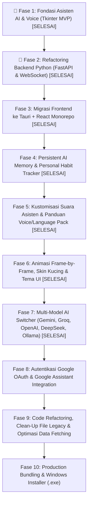

# 🐈 Pet Assistant - Global Development Roadmap

Dokumen ini berisi peta jalan (*roadmap*) pengembangan aplikasi **Pet Assistant** secara bertahap dari MVP sederhana berbasis Python Tkinter menuju Aplikasi Desktop Modern berbasis **Tauri + React + Python Backend**.

---

## 📍 Status Saat Ini: **Fase 7 (Selesai / Matang)**

---

## 🗺️ Tahapan Fase Pengembangan

---

### 🟢 Fase 1: Fondasi Asisten AI, Suara & Wake Word (Tkinter MVP)
> **Status**: ✅ **SELESAI**

- [x] **Floating Pet Widget**: Tampilan kucing melayang tanpa bingkai (*frameless transparent window*).
- [x] **Gemini AI Integration**: Fitur percakapan AI dengan konteks berkelanjutan (`gemini_brain.py`).
- [x] **Speech-To-Text (STT)**: Perekaman suara bebas terputus saat menjelaskan panjang (`pause_threshold = 2.0s`).
- [x] **Text-To-Speech (TTS)**: Pembacaan suara jawaban AI dengan kontrol ON/OFF & kecepatan suara (*speech rate*).
- [x] **Wake on Command**: Deteksi kata pemicu bertema kucing ("Hi Kitty", "Mew Mew", "Hey Kitty") gratis & offline (`openWakeWord`).
- [x] **State Tombol Otomatis**: Tombol mic berubah warna & teks secara otomatis saat kata pemicu terdeteksi.
- [x] **Panel Pengaturan Terpisah**: Navigasi layar pengaturan terisolasi dari layar obrolan utama.

---

### 🟡 Fase 2: Refactoring Backend Python (FastAPI & WebSocket)
> **Status**: ✅ **SELESAI**

- [x] Refactoring modul Python (`gemini_brain`, `stt`, `tts`, `wake_word_listener`) menjadi REST API & WebSocket Server berbasis **FastAPI**.
- [x] Implementasi WebSocket Stream untuk komunikasi data *real-time*:
  - Event deteksi Wake Word.
  - Streaming teks respon AI.
  - Sinkronisasi status audio / STT / TTS.
- [x] Pengelolaan file konfigurasi pengaturan (`settings.json`).

---

### 🔵 Fase 3: Transisi UI/UX ke Tauri + React (Monorepo)
> **Status**: ✅ **SELESAI**

- [x] Inisialisasi **Tauri v2 + React (Vite) + Glassmorphic CSS** di repositori tunggal ini (`pet-assisten/`).
- [x] Konfigurasi *Frameless, Transparent, Always-on-Top Floating Window* di `src-tauri/tauri.conf.json`.
- [x] Pembuatan UI Floating Pet Widget melayang menggunakan React.
- [x] Menghubungkan Client React UI ke Server Backend Python via WebSocket & REST API (`ws://127.0.0.1:8000/ws`).
- [x] Penataan ulang struktur repositori secara modular (`backend/`, `src/`, `src-tauri/`).
- [x] Implementasi Native WebView2 Window Dragging (`-webkit-app-region: drag`).
- [x] Implementasi Karakter Anime Manusia Kucing 'Kitty' & Teks Streaming Terstruktur (*Speech-Synced Text Stream*).

---

### 🧠 Fase 4: Persistent AI Memory & Personal Habit Tracker (`user_memory.json`)
> **Status**: ✅ **SELESAI**

- [x] **Sistem Memori Lokal (`backend/user_memory.json`)**:
  - Menyimpan fakta persisten tentang pengguna (nama panggilan, preferensi, makanan/hobi favorit, jam rutinitas).
  - Ekstraksi fakta baru secara otomatis dari setiap obrolan dengan Gemini.
- [x] **Dynamic Memory Injection**:
  - Memasukkan konteks memori pengguna secara otomatis ke dalam `system_instruction` Gemini di meper obrolan.
- [x] **UI Manager Memori di React**:
  - Halaman/tab khusus pada Settings Panel / Header (`MemoryPanel.jsx`) untuk melihat, menambah, atau menghapus daftar fakta memori yang diingat oleh AI.

---

### 🎙️ Fase 5: Kustomisasi Suara Asisten & Panduan Voice/Language Pack (TTS Manager)
> **Status**: ✅ **SELESAI**

- [x] **Voice Switcher UI**: Fitur memilih daftar suara (*Voice ID*) yang terinstall di Windows (SAPI5 & OneCore Voices) melalui REST API `GET /api/tts/voices`.
- [x] **Preview Sample Voice**: Tombol pemutar contoh suara (*Tes Suara*) di UI sebelum menyimpan pilihan suara.
- [x] **Panduan & Link Unduh Suara/Bahasa**:
  - Menyediakan panduan langkah demi langkah & link langsung (*direct shortcut*) ke **Windows Settings > Time & Language > Speech** (`ms-settings:speech`) untuk mengunduh paket suara (*Voice Packs*) tambahan (Bahasa Indonesia, Inggris, Jepang, dll.).
  - Dokumentasi cara mengaktifkan *Windows OneCore Voices* pihak ketiga / Natural Voices.
- [x] **Integrasi Settings**: Menyimpan pilihan suara (`voice_id`, `rate`, `volume`, `language`) ke `settings.json`.

---

### 🟣 Fase 6: Animasi Frame-by-Frame, Skin Kucing & Kustomisasi Tema
> **Status**: ✅ **SELESAI**

- [x] **Frame-by-Frame Sprite Animator (`FrameAnimator.jsx`)**:
  - Preloading frame PNG dinamis (hingga 12 frame `01.png` - `12.png`) ke memori tanpa blink/flickering.
  - Pengaturan FPS dan loop/transition yang mulus sesuai pose.
- [x] **Event-Driven Pose Mapping & Drag State**:
  - `lifted`: Aktif saat widget kucing di-drag/dipindahkan posisinya di layar.
  - `sit_forward`: Default idle & mode mendengarkan mikrofon (Voice Listening).
  - `sit_backward`: Berpaling saat AI sedang berpikir / memproses respon.
  - `licking`: Membersihkan diri / menjilat saat TTS membaca respon AI.
  - `sleeping`: Mode tidur otomatis saat tidak ada interaksi (AFK / Idle timeout).
  - `hide_n_seek`: Animasi intip/sembunyi saat widget diklik atau di-minimize.
- [x] **Skin Kucing Switcher (`catRegistry.js`)**:
  - Pilihan skin karakter: Orange Tabby (Oyen) & Tuxedo Black (Kuro).
  - Integrasi kartu preview thumbnail & checklist di panel pengaturan.
- [x] **UI Theme Engine (5 Preset Warna)**:
  - Catppuccin Mocha, Cyberpunk Neon, Kawaii Sakura, Nordic Ocean, Midnight Emerald.
  - Instant theme switching dan tersimpan persisten di `settings.json`.

---

### 🔴 Fase 7: Multi-Model AI Switcher & Integrasi AI Lanjutan
> **Status**: ✅ **SELESAI**

- [x] **Universal AI Brain Engine (`backend/ai_brain.py`)**:
  - Router terpadu untuk **Google Gemini**, **Groq Cloud (LPU Ultra Cepat)**, **OpenAI (GPT-4o/mini)**, **DeepSeek (V3/R1)**, **Ollama (Lokal Offline)**, dan **Custom Endpoint**.
  - Server-Sent Events (SSE) stream chunk realtime untuk respon instan.
  - Injeksi otomatis konteks memori pengguna (`user_memory.json`) & ekstraksi memori background.
- [x] **REST API & Probing Endpoints (`backend/main.py`)**:
  - `GET /api/ai/providers`: Metadata provider, deskripsi, dan daftar model.
  - `POST /api/ai/test`: Pengujian kredensial / koneksi instan.
  - `GET /api/ai/ollama/models`: Deteksi otomatis model AI yang terpasang di Ollama lokal.
- [x] **UI Panel Pengaturan AI (`SettingsPanel.jsx`)**:
  - Tab baru **"Model AI"** dengan kartu pilihan provider dan badge status.
  - Dropdown model dinamis sesuai provider yang dipilih.
  - Input API Key dengan tombol show/hide password.
  - Slider Temperature (Tingkat Kreativitas: 0.0 – 1.0).
  - Tombol **"⚡ Tes Koneksi Model AI"** dengan visual status badge langsung.

---

### 🟠 Fase 8: Autentikasi Google OAuth & Integrasi Google Assistant
> **Status**: ⏳ **Mendatang**

- [ ] Fitur Login Google (OAuth 2.0 Client) via Tauri Web Shell.
- [ ] Manajemen token autentikasi pengguna secara aman (*Secure Token Storage*).
- [ ] Integrasi Google Assistant API & Google Workspace Services (Calendar, Tasks, Gmail).

---

### 🧹 Fase 9: Code Refactoring, Clean-Up File Legacy & Optimasi Data Fetching/Caching
> **Status**: ⏳ **Mendatang**

- [ ] **Pembersihan File Legacy & Dead Code**:
  - Menghapus skrip Python Tkinter monolitik lama di root project (`robot_app.py`, file testing sisa, asset yang tidak terpakai).
  - Merapikan struktur direktori agar hanya menyisakan kode aktif (`backend/`, `src/`, `src-tauri/`).
- [ ] **Optimasi Data Fetching & In-Memory Caching di React**:
  - Mengimplementasikan sistem cache lokal/state cache agar buka-tutup Settings tidak melakukan request berulang (`GET /api/tts/voices`, `GET /api/ai/providers`, dll.).
  - Fetch data statis hanya satu kali saat inisialisasi aplikasi (*lazy/eager single-fetch*).
- [ ] **Optimasi Re-render & Network Overhead**:
  - Debounce dan memoization pada komponen reaktif.
  - Meminimalkan latensi WebSocket & REST API payload.

---

### ⚪ Fase 10: Production Bundling, Tauri Sidecar & Packaging (.exe)
> **Status**: ⏳ **Mendatang**

- [ ] Konfigurasi Tauri Sidecar (PyInstaller / Nuitka) untuk mengemas backend Python menjadi binary executable tanpa perlu instalasi Python di PC user.
- [ ] Optimasi penggunaan RAM & CPU idle.
- [ ] Pembuatan Single Installer Windows (`.exe` / `.msi`) yang terdistribusi dan siap pakai langsung (Plug-and-Play).

---

> 💡 **Petunjuk Penggunaan**:
> Ketika Anda ingin AI membuatkan rencana pelaksanaan (*plan*) untuk fitur tertentu, Anda cukup menyebutkan nomor Fase yang diinginkan (misal: `"/plan kerjakan Fase 8"` atau `"/plan kerjakan Fase 9"`).

